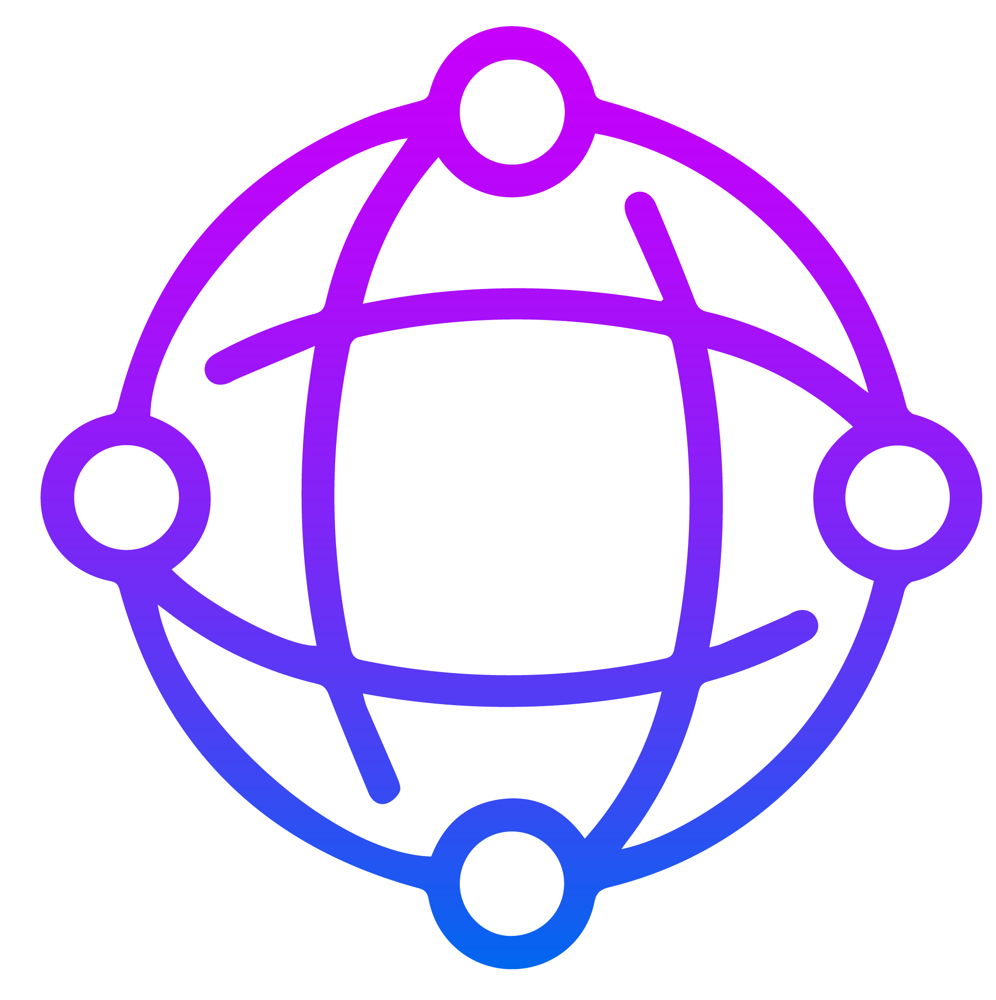

<p align="center">
  <a href="https://github.com/constellonautes/PIE_PROJECT">
    
  </a>
</p>

  <h1 align="center">HMI </h1>
A  JavaScript app to display constellations created by the java backend and visualize trajectories, zone covered, revisit time, etc .. 

Local server
------------

This app comes with a simple server ([`server.js`](./server.js)), but can be served through any means.

To use the packaged server:

* Install [node.js](http://nodejs.org/)
* From the `HMI` root directory, run
```
npm install
npm start
```

Browse to `http://localhost:8080/`

What's here?
------------

* [index.html](index.html) - A simple HTML page. Run a local web server, and browse to index.html to run your app, which will show our sample application.
* [FrontEnd](FrontEnd/) - Contains [App.js](Source/App.js) which is referenced from index.html.  This is where the app's code goes.
* [server.js](server.js) - A simple node.js server for serving your Cesium app.  See the **Local server** section.
* [package.json](package.json) - Dependencies for the node.js server.
* [utils](utils/) - useful script for the backend server.

Cesium resources
----------------

* [Reference Documentation](https://cesium.com/docs/cesiumjs-ref-doc/) : A complete guide to the Cesium API containing many code snippets.
* [Sandcastle](https://sandcastle.cesium.com/) : A live-coding environment with a large gallery of code examples.
* [Tutorials](https://cesium.com/docs/) : Detailed introductions to areas of Cesium development.
* [Cesium Forum](https://groups.google.com/forum/?hl=en#!forum/cesium-dev) : A resource for asking and answering Cesium-related questions.
